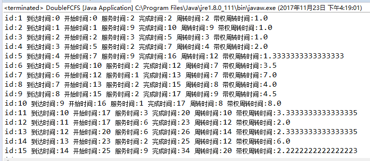

## 目录

Test 测试程序  
Task 每个人物创建一个Task对象  
IOData 读取/存储任务、生成测试数据  
SingleFCFS 单队列先进先出  
DoubleFCFS 双队列先进先出  
SingleSJF 单队列短作业优先  
DoubleSJF 双队列短作业优先  

## 实验结果

1.SingleFCFS  

2.DoubleFCFS  

3.SingleSJF  

4.DoubleSJF  
