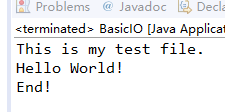
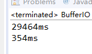
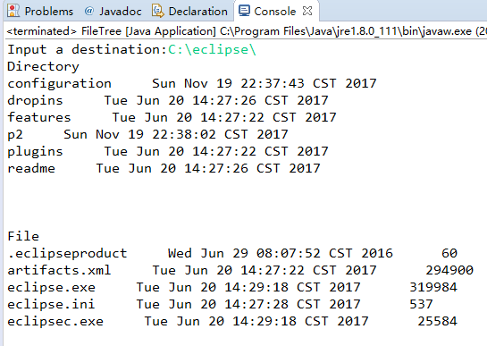
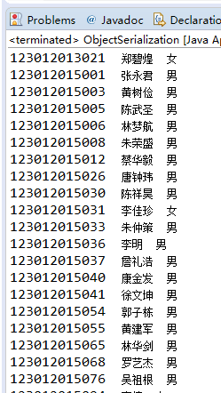

## 目录

BasicIO.java 基本IO操作  
BufferIO.java 带缓冲区的IO操作  
FileTree.java 获取系统文件数  
ObjectSerialization.java/Student.java  对象序列化练习  

## 实验结果

1.从src.txt读取文件到dest.txt  
然后从desc.txt读出信息并输出  

2.比较无buffer和有buffer复制文件所化的时间  

3.获取文件目录树，文件夹在前文件在后

4.从list.txt读入学生信息，存入Student对象，并进行排序，ObjectSerialization类使用list保存Student对象信息，然后将对象保存在student.bin文件中，最后从student.bin读出对象，打印对象的信息
